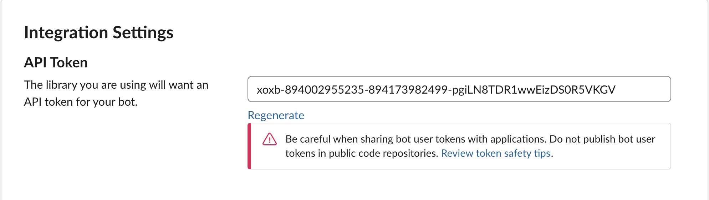

# Welcome to the slack message client wiki!

### Introduction

Slack message client read messages from java console and send them to slack,
It reads messages from slack and send them to java console. If we type "runBuild"
it will trigger build maven java project. All this is done in real-time

##How to use?

1. Create your own chat (team) in slack
2. Add incoming webhooks to Slack (https://yourChanel/apps)

3. Copy webhook url to WEBHOOK variable in SlackUtil class

4. Add Bots app.
 
5. Copy token to TOKEN variable in SlackUtil class
 
6. Invite slack bot to your channel (ex. @jSlack-bot)
 
7. Add the path to pom.xml of the project that you intend to build and add the path to maven bin directory on your PC

   ...

   Profit!